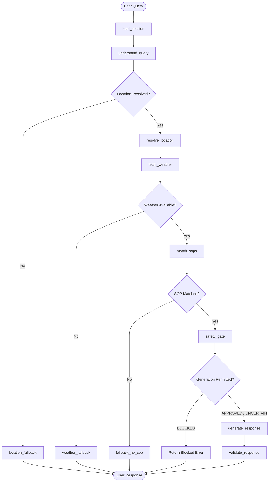

# Outdoor Safety Agent 🌦️🛡️

[](https://outdoor-safety-agent-85zs.onrender.com/)
[](https://www.python.org/downloads/)
[](https://fastapi.tiangolo.com)
[](https://langchain-ai.github.io/langgraph/)
[](https://open-meteo.com/)
[-success.svg)](evals/reports/eval_results.json)
[](LICENSE)

> 🌐 **Live Web Application (Deployed on Render):** [https://outdoor-safety-agent-85zs.onrender.com/](https://outdoor-safety-agent-85zs.onrender.com/)

An outdoor activity safety assistant operating on a deterministic **Safety Standard Operating Procedure (SOP)** engine. The agent grounds all safety recommendations in verified live meteorological facts from **Open-Meteo**, executes deterministic policy rules and conflict resolution, orchestrates state transitions via **LangGraph**, and constrains the LLM to natural-language explanation audited by an automated **Response Validator**.

---

## 1. Overview

Standard LLM chatbots frequently generate unsafe advice because they lack factual grounding, invent arbitrary weather thresholds, or fabricate weather conditions when uncertain.

The **Outdoor Safety Agent** eliminates safety hallucinations by separating concerns:
1. **Weather telemetry** provides externally sourced meteorological facts for the evaluated time window.
2. The **SOP Engine** evaluates mathematical, 3-valued boolean rules and resolves conflicts deterministically.
3. **LangGraph** orchestrates session memory, state propagation, and conditional fallbacks.
4. The **LLM Gateway** (powered by LiteLLM) synthesizes natural language strictly grounded in the policy decision.
5. The **Response Validator** verifies that the final text contains required citations, exact numbers, and zero ungrounded assertions before reaching the user.

---

## 2. Why the LLM Does Not Make the Safety Decision

This system intentionally does not ask the LLM:
> *"Is it safe to go cycling?"*

Instead:
1. **Open-Meteo** supplies verified meteorological facts for the evaluated time window.
2. The **policy engine** evaluates those facts against versioned SOPs using deterministic 3-valued logic.
3. **Conflict resolution** determines the governing policy through a documented hierarchy.
4. The **generation gate** determines whether a policy-backed recommendation can be generated.
5. Only then does the **LLM** turn the structured decision into natural language.
6. The **response validator** checks that the generated text remains faithful to the decision.

Therefore, changing the LLM model does not change the underlying safety policy. Changing a policy does not require changing the LLM prompt or LangGraph control flow.

---

## 3. Example Decision Trace

```text
User Query: "Can I cycle in Bhopal today?"

1. Weather Telemetry (Open-Meteo):
   • Temperature: 26.5°C
   • Wind Speed: 42.0 km/h
   • Precipitation: 0.0 mm

2. Candidate & Matched Policies:
   • CYC-001 — High Wind Cycling Hazard (Severity: HIGH, Priority: 80) → MATCHED
   • CYC-005 — Favorable Cycling Conditions (Severity: LOW, Priority: 20)  → MATCHED

3. Conflict Resolution:
   • CYC-001 selected over CYC-005 (higher severity: HIGH > LOW).

4. Generation Gate:
   • Status: APPROVED (evidence complete, generation authorized).

5. Deterministic Policy Decision:
   • Action: AVOID (cycling advised against due to 42.0 km/h crosswinds).

6. LLM Explanation:
   • Explains the decision strictly citing the 42.0 km/h wind reading and [CYC-001].

7. Response Validator Audit:
   • SOP Citation: PASS ([CYC-001] explicitly cited)
   • Metric Grounding: PASS (42.0 km/h verified against weather state)
   • Decision Fidelity: PASS (advises avoid; no weakening of severity)
```

---

## 4. Architecture

### 4.1 System Architecture

```
                    USER
                      │
                      ▼
                   FastAPI
                      │
                      ▼
                 LangGraph
                      │
       ┌──────────────┼──────────────┐
       ▼              ▼              ▼
    Weather          SOP            LLM
    Gateway         Engine         Gateway
       │              │              │
       ▼              ▼              ▼
   Open-Meteo     YAML SOPs       LiteLLM
 (Authoritative) (26 Policies) (Configured
       │              │        via .env)
       └───────┬──────┘
               ▼
        Safety Decision
               │
               ▼
       Response Validator
               │
               ▼
             USER
```

### 4.2 LangGraph Workflow

The conversational lifecycle runs as a directed graph with explicit conditional branches:



### 4.3 Data Flow

| Step | Component | Input | Output | Invariant Enforced |
| :--- | :--- | :--- | :--- | :--- |
| 1 | `understand_query` | Raw query string + session context | `QueryIntent` (activity, location, time) | Preserves conversational context across turns |
| 2 | `resolve_location` | City / region name | Coordinates (`lat`, `lon`, `name`) | Open-Meteo geocoding |
| 3 | `fetch_weather` | Coordinates | `WeatherState` | Strictly meteorological data; no synthetic numbers |
| 4 | `match_sops` | Activity + `WeatherState` | Evaluated SOPs + Conflict Resolution | Deterministic 3-valued boolean logic |
| 5 | `safety_gate` | Evaluation + Evidence | Gate Status (`APPROVED`, `UNCERTAIN`, `BLOCKED`) | Prevents ungrounded responses |
| 6 | `generate_response` | Decision + Trace + Facts | Natural language explanation | Constrained prompt; bounded LLM retry |
| 7 | `validate_response` | Generated text | Audited response or template fallback | 8 deterministic grounding rules |

---

## 5. SOP / Policy Engine

### 5.1 Policy Representation

Policies are stored as independent, schema-validated YAML files in `policies/`. Each policy defines activities, thresholds, evidence requirements, and severity:

```yaml
id: CYC-001
version: 1.0.0
status: active
title: High Wind Crosswind Hazard for Cycling
category: cycling
activities:
  - cycling
  - bike
  - bicycling
severity: high
priority: 80
conditions:
  all:
    - field: weather.wind_speed_10m
      operator: ">="
      value: 40.0
    - field: weather.precipitation
      operator: "<="
      value: 5.0
evidence:
  - weather.wind_speed_10m
decision: Avoid cycling. Dangerous crosswind buffeting risk on exposed roadways.
rationale: Sustained winds at or exceeding 40 km/h cause severe lateral instability and increase collision risks.
tags:
  - wind
  - cycling
  - safety
overrides: []
source: project_defined
effective_from: "2024-01-01"
```

### 5.2 Policy Catalogue

The repository contains **26 versioned policies across seven categories**:

| Category | Count | Directory | Primary Safety Concerns |
| :--- | :---: | :--- | :--- |
| **Cycling** | 5 | [`policies/cycling/`](policies/cycling) | Crosswinds (`CYC-001`), monsoon slick roads (`CYC-002`), heat stress (`CYC-003`), black ice (`CYC-004`), favorable commuting (`CYC-005`) |
| **Exercise** | 4 | [`policies/exercise/`](policies/exercise) | Extreme heat & humidity (`EXE-001`), freezing wind chill (`EXE-002`), severe AQI (`EXE-003`), torrential rain (`EXE-004`) |
| **Hiking** | 4 | [`policies/hiking/`](policies/hiking) | Hypothermia risk (`HIK-001`), flash flood runoff (`HIK-002`), alpine lightning threat (`HIK-003`), dense mountain fog (`HIK-004`) |
| **Recreation** | 3 | [`policies/recreation/`](policies/recreation) | Multi-factor picnic suitability (`REC-001`), extreme UV index (`REC-002`), golden weather window (`REC-003`) |
| **Family** | 3 | [`policies/family/`](policies/family) | Playground slide surface burns (`FAM-001`), sudden rain on toddlers (`FAM-002`), stroller heat trap (`FAM-003`) |
| **Travel** | 3 | [`policies/travel/`](policies/travel) | Highway zero-visibility fog (`TRV-001`), aquaplaning standing water (`TRV-002`), high-profile vehicle tip risk (`TRV-003`) |
| **Hazards** | 4 | [`policies/hazards/`](policies/hazards) | Compound squall & rain system (`HAZ-001`), thunderstorm & lightning (`HAZ-002`), heatstroke emergency (`HAZ-003`), coastal gale gusts (`HAZ-004`) |
| **TOTAL** | **26** | | |

> **Note on `REC-001` (Multi-Factor Picnic Suitability):** Rather than evaluating a single isolated threshold, `REC-001` demonstrates a deterministic multi-factor policy assessing precipitation, precipitation probability, and soil moisture saturation to determine whether picnic conditions are suitable, conditionally suitable, or unfavorable.

### 5.3 Deterministic Policy Evaluation & 3-Valued Logic

Conditions are evaluated using an AST-compatible schema supporting comparison operators (`==`, `!=`, `<`, `<=`, `>`, `>=`, `in`, `not_in`) and logical operators (`all`, `any`, `not`):

* **`TRUE`**: Every condition is verified against the weather telemetry.
* **`FALSE`**: At least one condition definitively fails.
* **`UNKNOWN`**: A required sensor field is missing from the payload (e.g., UV sensor offline). A policy with `UNKNOWN` conditions cannot be marked `APPROVED`.

### 5.4 Conflict Resolution Hierarchy

When multiple policies trigger simultaneously, the engine applies a deterministic 5-step hierarchy:
1. **Explicit Overrides:** A policy declaring `overrides: ["CYC-002"]` (such as `HAZ-001`) automatically suppresses the overridden policy.
2. **Severity Hierarchy:** `extreme` (5) > `high` (4) > `moderate` (3) > `low` (2) > `info` (1).
3. **Priority Integer Score:** Tie-breaker score (1–100).
4. **Specificity:** Policies with more tightly constrained conditions receive precedence.
5. **Deterministic Tie-Breaker:** Lexicographical ordering by policy ID.

### 5.5 Adding a New SOP Without Modifying Code

Adding an SOP requires **zero changes to Python control flow code**:
1. Drop a YAML file into `policies/<category>/<ID>.yaml`.
2. The `PolicyRegistry` automatically discovers, lints, and indexes the policy at startup.
3. Verified in automated test: `tests/test_policy_loader.py::test_dynamic_sop_addition_without_code_changes`.

---

## 6. Weather System

### 6.1 Open-Meteo as the Authoritative Provider

* **Open-Meteo is the mandatory weather provider.** The system remains fully functional using Open-Meteo alone with zero API keys required.
* Optional secondary providers (OpenWeatherMap, WeatherAPI.com) are used strictly for cross-validation and discrepancy detection when their API keys are configured. The system never depends on them.

### 6.2 Geocoding & Telemetry

* User queries (e.g., *"Bhopal"*, *"Chennai"*) are resolved to latitude/longitude coordinates via Open-Meteo's geocoding API.
* The system requests explicit current and hourly fields:
  * `temperature_2m`, `apparent_temperature`
  * `relative_humidity_2m`
  * `precipitation`, `precipitation_probability`
  * `weather_code` (WMO standards)
  * `wind_speed_10m`, `wind_gusts_10m`
  * `uv_index`, `visibility`

### 6.3 Discrepancy Detection (Optional Secondary Mode)

When secondary providers are configured, cross-provider discrepancy thresholds flag caution:
* Temperature difference $> 5.0^\circ\text{C}$ $\to$ Flags `UNCERTAIN`
* Wind speed difference $> 15.0\text{ km/h}$ $\to$ Flags `UNCERTAIN`
* Precipitation difference $> 10.0\text{ mm}$ $\to$ Flags `UNCERTAIN`

### 6.4 Weather Failure Handling

If geocoding fails or Open-Meteo is unreachable, the system executes the `weather_fallback` node:
* It does **not** fabricate numbers.
* It does **not** fall back to general conversational safety advice.
* It honestly informs the user: *"Weather data currently unavailable for [Location]. A policy-backed safety assessment cannot be completed without verified meteorological data."*

---

## 7. LLM Architecture

### 7.1 Model Responsibilities

The LLM gateway (built on **LiteLLM**) is restricted to:
1. Natural language query intent extraction (`understand_query`).
2. Composing the user-facing explanation grounded in the deterministic decision (`generate_response`).

Active model configuration is environment-driven through LiteLLM. The repository supports a primary model and optional provider fallbacks configured via `.env`.

The LLM is **strictly forbidden** from:
* Deciding safety outcomes or severities.
* Selecting or overriding SOPs.
* Inventing weather numbers.

### 7.2 Bounded Retries & Provider Fallback

To prevent transient LLM outages from blocking user responses when the policy decision is already calculated:
* **Bounded Retries with Jitter:** Transient errors (rate limits, service spikes, timeouts) are retried with exponential backoff and random jitter ($T = \text{random}(0.1, \min(\text{max\_delay}, \text{base} \times 2^{\text{attempt}-1}))$).
* **Non-Retriable Failover:** Non-retriable exceptions (e.g., exhausted account credits or invalid authentication) immediately failover to backup providers.
* **Deterministic Template Fallback:** If all LLM providers fail, the system falls back to a deterministic structured template, allowing the system to continue producing a policy-backed response when the LLM provider is unavailable:
  ```text
  📍 Current Conditions:
  • Location: Bhopal
  • Live Weather: 22.7°C, wind 6.6 km/h, precipitation 0.0 mm

  🛡️ Applicable Safety Policy:
  • Policy: [CYC-005: Favorable and Safe Conditions for Cycling and Commuting]
  • Severity: LOW

  📋 Recommendation:
  • Optimal cycling conditions. Maintain standard traffic vigilance.

  💡 Rationale:
  • Clear weather with calm winds provides ideal visibility and vehicle control.
  ```

---

## 8. Safety & Grounding

### 8.1 Pre-Generation Safety Gate

Before any text generation, the `safety_gate` node audits the execution state. 

> **Important Conceptual Distinction:** The generation gate status (`APPROVED`, `UNCERTAIN`, `BLOCKED`) indicates whether the system has sufficient verified evidence to output a policy-backed response; it does **not** indicate whether the activity itself is safe. The policy recommendation (`AVOID`, `CAUTION`, `SAFE`) dictates the activity guidance.

* **`APPROVED`**: Valid location, verified weather telemetry, complete evidence satisfying all SOP conditions. The system is authorized to generate advice.
* **`UNCERTAIN`**: Missing sensor metrics or cross-provider discrepancy. Advises caution without asserting unsafe claims.
* **`BLOCKED`**: Geocoding failure, weather service timeout, or critical alert. Halts advice generation.

### 8.2 Post-Generation Response Validator (8 Rules)

Every LLM response is checked by `ResponseValidator`:
1. **Rule 1 (SOP Citation):** Response must cite the active SOP ID (e.g., `[CYC-001]`).
2. **Rule 2 (Metric Grounding):** Every weather number cited must match the verified weather state within tolerance. Hallucinated numbers trigger immediate rejection.
3. **Rule 3 (Honest No-SOP Boundary):** When no SOP applies, the response must explicitly declare that no policy covers the activity.
4. **Rule 4 (Severity Alignment):** The LLM cannot downplay an `extreme` or `high` risk into a suggestion.
5. **Rule 5 (Decision Fidelity):** Recommendations must mirror the policy's deterministic decision.
6. **Rules 6–8:** Rationale consistency, prompt injection/jailbreak defense, and schema integrity.

### 8.3 Structured Decision Trace

Every response returns an auditable decision trace:
```json
{
  "query": "Can I cycle to work in Bhopal today during this monsoon system?",
  "intent": {"activity": "cycling", "location": "Bhopal", "time": null},
  "location": {"name": "Bhopal", "latitude": 23.25, "longitude": 77.41},
  "weather": {"temperature_2m": 26.5, "wind_speed_10m": 28.0, "precipitation": 34.0},
  "candidate_policies": ["CYC-001", "CYC-002", "HAZ-001"],
  "matched_policies": ["CYC-002", "HAZ-001"],
  "conflict_resolution": {
    "override_applied": "HAZ-001 overrides CYC-002",
    "selected_id": "HAZ-001",
    "reason": "Explicit safety override"
  },
  "selected_policy": {"id": "HAZ-001", "severity": "extreme", "title": "Severe Compound Weather: Heavy Rainfall and Squall Gale Alert"},
  "generation_gate": "APPROVED",
  "policy_decision": "AVOID"
}
```

---

## 9. Session Memory

The agent maintains in-memory conversational sessions (`app/memory/session.py`) to support multi-turn dialogues:
* **Turn 1:** *"Can I cycle in Chennai today?"* $\to$ Resolves Chennai, fetches 42 km/h wind, triggers `[CYC-001]`.
* **Turn 2:** *"What about this evening instead?"* $\to$ Preserves `location: Chennai` and `activity: cycling` without re-asking.
* **Turn 3:** *"What about Bhopal?"* $\to$ Updates location to Bhopal while keeping `activity: cycling`.
* **Session Isolation:** Separate `session_id` instances remain completely isolated.

---

## 10. Model Context Protocol (MCP) Interface

The repository includes a standards-compliant **Model Context Protocol (MCP)** server in `mcp/weather_server/server.py` exposing 5 tools over JSON-RPC:
* `resolve_location`: Geocodes city names.
* `get_current_weather`: Fetches current verified weather observations.
* `get_hourly_weather`: Hourly forecast metrics.
* `get_daily_weather`: Daily forecasts and aggregated extremes.
* `compare_weather`: Compares current conditions with daily extremes.

> **Architectural Clarification:** MCP is an **optional external interface** allowing external agent clients to query weather and tools over JSON-RPC. LangGraph does **not** depend on MCP internally; the LangGraph agent executes native Python modules directly.

---

## 11. Evaluation & Verification

### 11.1 Evaluation Strategy: Live vs. Replay

The test harness uses two distinct evaluation mechanisms:
1. **Live Evaluation:** Connects to the live Open-Meteo endpoint at evaluation runtime to validate real geocoding, real weather telemetry retrieval, and grounded policy evaluation.
2. **Replay Benchmark:** Uses 55 deterministic replay fixtures captured from real Open-Meteo weather patterns to ensure deterministic regression testing when external weather conditions change.

### 11.2 Replay Benchmark Results — 55/55 Passed

Run the benchmark suite:
```bash
python evals/runner.py
```

| Category | Cases | Focus | Pass Rate |
| :--- | :---: | :--- | :---: |
| `clear_sop` | 10 | Direct trigger of cycling, hiking, playground, and exercise rules | **100.0%** (10/10) |
| `paraphrased` | 10 | Synonyms: *"two-wheeler"*, *"monkey bars"*, *"lunch basket"*, *"10k cardio"* | **100.0%** (10/10) |
| `severe_weather` | 5 | Heavy compound rainfall, Bay of Bengal squalls, alpine freeze | **100.0%** (5/5) |
| `no_sop` | 5 | Out-of-scope activities: chess, bird photography, balcony reading | **100.0%** (5/5) |
| `failure_resilience` | 5 | Geocoding failure, network timeout, unreachable provider | **100.0%** (5/5) |
| `missing_evidence` | 5 | Missing wind/rain sensor fields triggering `UNCERTAIN` status | **100.0%** (5/5) |
| `conflict_resolution` | 5 | `HAZ-001` overriding `CYC-002`, `HAZ-004` overriding `TRV-002` | **100.0%** (5/5) |
| `adversarial` | 5 | Prompt injections, fake policy claims, instructions to ignore rain | **100.0%** (5/5) |
| `session_memory` | 2 | Context retention of location and activity across turns | **100.0%** (2/2) |
| `grounding` | 3 | Exact metric verification (42.0 km/h wind, 43.5°C temp, 34.0 mm rain) | **100.0%** (3/3) |
| **TOTAL** | **55** | **Comprehensive Full System Verification** | **100.0%** |

### 11.3 Live Open-Meteo Verification

The live evaluation makes a real Open-Meteo request at runtime. Because live weather is dynamic and location-dependent, the live evaluation result is reported separately from the replay benchmark.

Executing `python evals/runner.py` automatically runs the live Open-Meteo grounding evaluation before starting the replay suite:
* Resolves live coordinates for the test location.
* Retrieves current verified telemetry from the Open-Meteo API.
* Executes the policy engine and generates a timestamped audit artifact in `evals/reports/live_open_meteo_audit.json`:
  * Timestamp & location coordinates
  * Retrieved weather metrics (`temperature_2m`, `wind_speed_10m`, `precipitation`)
  * Evaluated policy ID
  * Generation gate status & grounding verification

### 11.4 Mutation Testing

To prove that the evaluation suite is sensitive to policy changes, `evals/mutation.py` mutates `CYC-001`'s wind threshold from $40.0\text{ km/h}$ to $50.0\text{ km/h}$. Under $42.0\text{ km/h}$ winds, the baseline triggers `CYC-001`, but the mutated policy refuses to trigger:
```bash
python evals/mutation.py
```
```text
✓ Baseline check PASSED: Wind 42 km/h triggers CYC-001 threshold (>= 40.0 km/h).
✓ Mutation applied: CYC-001 threshold shifted from 40.0 -> 50.0 km/h.
  Result with mutation: Selected SOP changed from CYC-001 -> None
✓ MUTATION KILLED: Evaluation suite successfully detected behavioral divergence!
✓ Policy restored to original specification.
```

---

## 12. Project Structure

```
weather_agent/
├── app/
│   ├── config.py                 # Pydantic Settings
│   ├── main.py                   # FastAPI web and API application
│   ├── graph/                    # LangGraph orchestration
│   │   ├── graph.py              # StateGraph definition and routing
│   │   ├── state.py              # SafetyState TypedDict schema
│   │   └── nodes/                # Focused, single-responsibility graph nodes
│   │       ├── understand.py     # Intent parsing & session carry-forward
│   │       ├── weather.py        # Location resolution & telemetry retrieval
│   │       ├── policy.py         # Candidate matching & conflict resolution
│   │       ├── safety.py         # Safety gate evaluation
│   │       └── response.py       # Generation & 8-rule validation
│   ├── policy/                   # Deterministic SOP Engine
│   │   ├── evaluator.py          # 3-valued boolean DSL evaluator
│   │   ├── models.py             # SOP, Condition, and Rule models
│   │   ├── registry.py           # In-memory policy store and indexer
│   │   ├── resolver.py           # Conflict resolver & decision trace
│   │   └── validator.py          # Policy schema linter
│   ├── weather/                  # Weather telemetry
│   │   ├── gateway.py            # Authoritative Open-Meteo gateway
│   │   ├── models.py             # WeatherState & Location models
│   │   └── providers/            # Open-Meteo (primary), OpenWeather, WeatherAPI
│   ├── llm/                      # LLM Gateway
│   │   ├── gateway.py            # LiteLLM gateway with backoff & failover
│   │   └── templates.py          # Structured template fallback engine
│   ├── safety/                   # Safety audits
│   │   ├── gate.py               # Pre-generation safety gate
│   │   └── validator.py          # Post-generation response validator
│   └── memory/                   # Multi-turn session memory
│       └── session.py            # SessionMemoryStore
├── policies/                     # 26 versioned YAML policies
│   ├── cycling/                  # CYC-001 to CYC-005
│   ├── exercise/                 # EXE-001 to EXE-004
│   ├── hiking/                   # HIK-001 to HIK-004
│   ├── recreation/               # REC-001 to REC-003
│   ├── family/                   # FAM-001 to FAM-003
│   ├── travel/                   # TRV-001 to TRV-003
│   └── hazards/                  # HAZ-001 to HAZ-004
├── evals/                        # Evaluation & benchmarking
│   ├── cases/test_cases.json     # 55 benchmark test cases
│   ├── fixtures/                 # Deterministic replay fixtures
│   ├── runner.py                 # Live & replay benchmark runner
│   └── mutation.py               # Mutation sensitivity test
├── tests/                        # 36 Pytest unit & integration tests
│   ├── graph/test_graph.py
│   ├── policy/                   # DSL, evaluator, and resolver tests
│   ├── safety/test_safety.py
│   ├── weather/test_weather.py
│   └── test_policy_loader.py
├── frontend/                     # Glassmorphic dark-mode web application
├── mcp/                          # Optional MCP server interface
├── .env.example                  # Environment template
├── .gitignore                    # Git exclusions
├── requirements.txt              # Project dependencies
└── README.md
```

---

## 13. Setup & Installation

### Prerequisites
* Python 3.12+
* Internet access (for Open-Meteo live API calls)

### Setup Steps
```bash
# 1. Clone repository
git clone https://github.com/Vikas9892/Weather-Agent.git
cd Weather-Agent

# 2. Create virtual environment
python -m venv .venv
source .venv/bin/activate  # On Windows: .venv\Scripts\activate

# 3. Install dependencies
pip install -r requirements.txt

# 4. Configure environment (optional)
cp .env.example .env
```

> **Note:** Open-Meteo requires **no API key**. The application runs out of the box. Adding LLM keys enables natural language explanations; omitting them automatically uses the deterministic template engine.

---

## 14. Running the Application
 
### Local Development
```bash
# Start the FastAPI server on port 8001
uvicorn app.main:app --host 127.0.0.1 --port 8001
```

* **Interactive Web Interface:** Open `http://localhost:8001` in your browser.
* **API Documentation:** Interactive OpenAPI documentation at `http://localhost:8001/docs`.
* **Health Check:** `http://localhost:8001/health`.

### Live Cloud Deployment (Render)
The application is deployed and hosted live on Render:
* **Live Web App:** [https://outdoor-safety-agent-85zs.onrender.com/](https://outdoor-safety-agent-85zs.onrender.com/)
* **Health Endpoint:** [https://outdoor-safety-agent-85zs.onrender.com/health](https://outdoor-safety-agent-85zs.onrender.com/health)
* **API Documentation:** [https://outdoor-safety-agent-85zs.onrender.com/docs](https://outdoor-safety-agent-85zs.onrender.com/docs)

---

## 15. Running Tests

```bash
# 1. Run all 36 Pytest unit and integration tests
pytest -v tests

# 2. Run the 55-case benchmark evaluation suite (Live + Replay)
python evals/runner.py

# 3. Run mutation testing
python evals/mutation.py
```

---

## 16. Assignment Requirement Coverage

| Requirement | Implementation Module | Verification Evidence |
| :--- | :--- | :--- |
| **A. Outdoor activity safety chatbot** | [`app/main.py`](app/main.py), [`frontend/`](frontend) | Web UI at `/`, REST API at `/api/chat` |
| **B. Safety advice from written SOPs** | [`policies/`](policies) | 26 YAML policies in 7 categories |
| **C. Explicit statement when no SOP applies** | [`app/graph/nodes/response.py`](app/graph/nodes/response.py) | Verified in `CASE-026` through `CASE-030` |
| **D. Policies changeable without code changes** | [`app/policy/registry.py`](app/policy/registry.py) | Tested in `test_dynamic_sop_addition_without_code_changes` |
| **E. Real LangGraph with meaningful branching** | [`app/graph/graph.py`](app/graph/graph.py) | 5 conditional routes: location, weather, no-sop, gate, validation |
| **F. Session memory with turn carry-forward** | [`app/memory/session.py`](app/memory/session.py) | Tested in `CASE-051`, `CASE-052` |
| **G. Weather from Open-Meteo** | [`app/weather/providers/open_meteo.py`](app/weather/providers/open_meteo.py) | Verified live in `run_live_open_meteo_eval` |
| **H. City geocoding via Open-Meteo** | [`app/weather/gateway.py`](app/weather/gateway.py) | Geocodes city to lat/lon before weather lookup |
| **I. Explicit request of weather fields** | [`app/weather/providers/open_meteo.py`](app/weather/providers/open_meteo.py) | Queries wind, gusts, rain, rain prob, temp, humidity, UV, visibility |
| **J. Honest failure on weather/geocoding error** | [`app/graph/nodes/weather.py`](app/graph/nodes/weather.py) | Verified in `CASE-031` through `CASE-035` |
| **K. Never fabricate unavailable weather** | [`app/safety/validator.py`](app/safety/validator.py) | Rule 2 detects and rejects ungrounded numbers |
| **L. 10+ SOPs across 3+ categories** | [`policies/`](policies) | 26 policies across 7 categories |
| **M. Varied severity levels** | [`policies/`](policies) | `low`, `moderate`, `high`, `extreme` |
| **N. Fuzzy / non-numeric policy** | [`policies/recreation/REC-001.yaml`](policies/recreation/REC-001.yaml) | Multi-factor picnic suitability policy evaluating damp ground and rain probability |
| **O. Multiple SOPs match simultaneously** | [`app/policy/evaluator.py`](app/policy/evaluator.py) | Evaluates all candidate policies for activity |
| **P. Deterministic conflict resolution** | [`app/policy/resolver.py`](app/policy/resolver.py) | 5-step hierarchy: Overrides > Severity > Priority > Specificity |
| **Q. Traceability to specific SOP** | [`app/safety/validator.py`](app/safety/validator.py) | Rule 1 enforces `[SOP-ID]` citation; trace returned in JSON |
| **R. LLM cannot invent safety facts** | [`app/graph/nodes/response.py`](app/graph/nodes/response.py) | Decision pre-computed before LLM invocation |
| **S. Comprehensive evaluation categories** | [`evals/cases/test_cases.json`](evals/cases/test_cases.json) | 55 test cases across 8 categories |
| **T. Severe weather tested live & replay** | [`evals/runner.py`](evals/runner.py) | Live Open-Meteo call + deterministic replay fixtures |
| **U. Honest failure reporting** | [`evals/runner.py`](evals/runner.py) | Evaluates real errors; zero fabricated metrics |
| **V. Adding SOP requires 0 code changes** | [`tests/test_policy_loader.py`](tests/test_policy_loader.py) | Automated test creates, loads, and tests `CYC-006` dynamically |

---

## 17. Design Decisions & Trade-offs

1. **Why YAML SOPs instead of hardcoded Python rules?**
   * *Decision:* Store policies as human-readable YAML documents.
   * *Trade-off:* Requires an explicit validation layer, but enables non-engineers to audit, update, or add safety policies with zero risk of breaking control-flow code.
2. **Why 3-Valued Logic (`TRUE`, `FALSE`, `UNKNOWN`)?**
   * *Decision:* When sensor telemetry is missing, evaluate conditions to `UNKNOWN`.
   * *Trade-off:* Slightly more complex DSL evaluator, but prevents fatal false-negative safety conclusions when a sensor is offline.
3. **Why Open-Meteo as primary with optional secondary providers?**
   * *Decision:* Make Open-Meteo the mandatory foundation and secondary APIs optional.
   * *Trade-off:* Eliminates dependency on multiple paid API keys while enabling multi-provider discrepancy checks for high-assurance deployments.
4. **Why deterministic template fallback over LLM retry-forever?**
   * *Decision:* Cap retries at 5 attempts, then transition to a pre-formatted deterministic template.
   * *Trade-off:* The response is more structured and less conversational, but allows the system to continue producing a deterministic policy-backed response when the LLM provider is unavailable.
