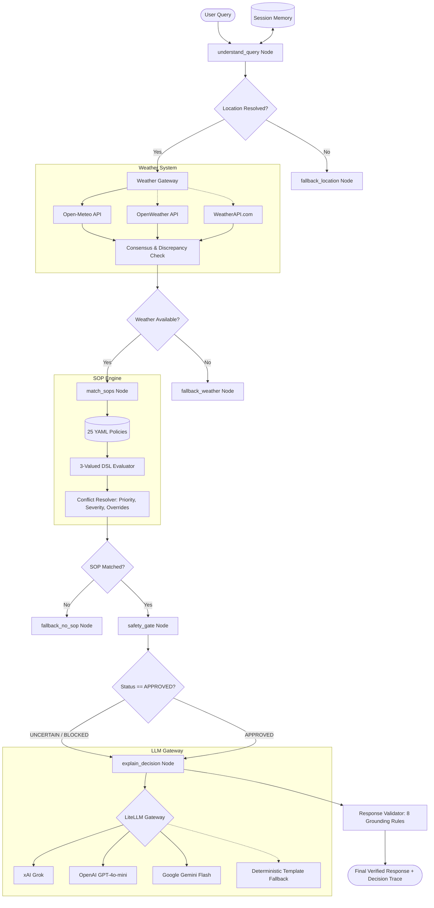

# Outdoor Activity Safety Agent 🌦️🛡️

[](https://www.python.org/downloads/)
[](https://fastapi.tiangolo.com)
[](https://langchain-ai.github.io/langgraph/)
[](https://open-meteo.com/)
[-success.svg)](evals/reports/eval_results.json)
[](LICENSE)

An enterprise-grade, deterministic outdoor activity safety assistant. Unlike typical LLM chatbots that casually guess safety advice, this agent operates on a strict **Safety Standard Operating Procedure (SOP)** engine backed by live weather data from **Open-Meteo**, **OpenWeatherMap**, and **WeatherAPI.com**, orchestrated by **LangGraph**, and verified by a **Two-Phase Safety Gate & Response Validator**.

---

## 🏛️ Core Engineering Philosophy

The fundamental design principle of this system is that **the LLM is NOT the source of truth for safety**:

```
Live Weather APIs (Open-Meteo / OpenWeather / WeatherAPI)
                     ↓  (verifiable meteorological facts)
        Deterministic SOP Policy Engine & DSL
                     ↓  (mathematical 3-valued rule evaluation & conflict resolution)
             LangGraph State Orchestration
                     ↓  (branching, fallbacks, and safety gates)
           Multi-Model LLM Gateway (Grok / OpenAI / Gemini)
                     ↓  (natural language explanation grounded strictly in facts)
          Deterministic 8-Rule Response Validator
                     ↓  (blocks hallucinations & ungrounded metrics)
             Safe, Actionable User Response
```

> **The Golden Rule:** The LLM is permitted to explain the safety decision in natural language, but it is **strictly forbidden from inventing thresholds, overruling policy, or fabricating weather conditions**.

---

## 📐 Architecture & Workflow



---

## ❓ Why LangGraph?

Traditional LLM chains (e.g. linear LangChain Runnables) execute blindly from start to finish. In critical safety applications, linear chains fail catastrophically when edge cases arise.

**LangGraph provides:**
1. **Explicit Conditional Branching:** Routes directly to specialized fallback nodes (`fallback_location`, `fallback_weather`, `fallback_no_sop`) without wasting LLM tokens or risking hallucinations.
2. **Stateful Graph Execution:** Accumulates verified state (`QueryIntent`, `Location`, `WeatherState`, `CandidateSOPs`, `SelectedSOP`, `DecisionTrace`, `SafetyStatus`) across turns.
3. **Deterministic Safety Gating:** Allows halting or redirecting execution at the `safety_gate` step prior to generating user-facing language.
4. **Reproducibility & Inspection:** Every step records a node trace that can be fully replayed and audited for compliance.

---

## 📜 Deterministic SOP Policy Engine & DSL

The safety engine houses **25 curated standard operating procedures** formatted in human-readable, schema-validated YAML across 7 domains:

| Category | SOP Count | Example Policies |
| :--- | :---: | :--- |
| **Cycling** (`cycling/`) | 4 | `CYC-001` (Crosswinds >= 40 km/h), `CYC-002` (Monsoon / Slick Roads), `CYC-003` (Heat Stress), `CYC-004` (Sub-Zero Black Ice) |
| **Exercise** (`exercise/`) | 4 | `EXE-001` (Extreme Heat & Humidity), `EXE-002` (Freezing Wind Chill), `EXE-003` (Severe Air Quality / AQI), `EXE-004` (Heavy Downpour) |
| **Hiking** (`hiking/`) | 4 | `HIK-001` (Sub-Zero Hypothermia Risk), `HIK-002` (Flash Flood & Gully Wash), `HIK-003` (Alpine Lightning Threat), `HIK-004` (Dense Mountain Fog) |
| **Recreation** (`recreation/`) | 4 | `REC-001` (Soggy Ground / Post-Rain Damp), `REC-002` (High UV Index Sunburn), `REC-003` (Golden Window / Ideal Conditions), `REC-004` (Strong Gusts / Flying Tarps) |
| **Family** (`family/`) | 3 | `FAM-001` (Playground Surface Burn Hazard), `FAM-002` (Sudden Rain on Toddlers), `FAM-003` (Stroller Heat Trap) |
| **Travel** (`travel/`) | 3 | `TRV-001` (Highway Zero-Visibility Fog), `TRV-002` (Aquaplaning Standing Water), `TRV-003` (Gale Force High-Profile Vehicle Tip Risk) |
| **Hazards** (`hazards/`) | 3 | `HAZ-001` (IMD Monsoon Low-Pressure Depression), `HAZ-002` (Severe Thunderstorm & Lightning), `HAZ-003` (Government Heatwave Emergency) |

### 3-Valued Logic DSL (`TRUE`, `FALSE`, `UNKNOWN`)
Conditions are expressed in an AST-compatible schema:
```yaml
conditions:
  all:
    - field: weather.wind_speed_10m
      operator: ">="
      value: 40.0
    - field: weather.precipitation
      operator: "<="
      value: 5.0
```
If required weather metrics are absent (e.g., sensor failure), the condition evaluates to `UNKNOWN` rather than crashing or falsifying, prompting the Safety Gate to flag `UNCERTAIN`.

### Conflict Resolution Hierarchy
When multiple SOPs match simultaneously (e.g., a monsoon low-pressure system while cycling):
1. **Explicit Overrides:** A policy declaring `overrides: ["CYC-002"]` (such as `HAZ-001`) automatically suppresses the overridden policy.
2. **Severity Hierarchy:** `extreme` > `high` > `moderate` > `low` > `info`.
3. **Priority Score:** Explicit integer tie-breaker (1–100).
4. **Specificity:** Policies with more tightly constrained conditions receive precedence.

---

## 🌐 Multi-Provider Weather System

The weather subsystem connects to three premier global weather APIs with transparent fallbacks and consensus validation:

1. **Open-Meteo (Primary):**
   - Free, open-access, zero API key required.
   - High-resolution global atmospheric models (ECMWF, GFS, ICON).
   - Built-in geocoding service.
2. **OpenWeatherMap (Secondary / Discrepancy Check):**
   - Supported via `OPENWEATHER_API_KEY`.
   - Global standard endpoint `https://api.openweathermap.org/data/2.5/weather`.
3. **WeatherAPI.com (Secondary / Discrepancy Check):**
   - Supported via `WEATHERAPI_KEY`.
   - High-precision telemetry `https://api.weatherapi.com/v1/current.json`.

### Provider Consensus & Discrepancy Detection
If secondary providers are enabled, the `WeatherGateway` automatically performs cross-provider delta analysis:
- **Temperature discrepancy:** > 5.0°C difference flags `UNCERTAIN` status.
- **Wind speed discrepancy:** > 15.0 km/h difference flags `UNCERTAIN` status.
- **Precipitation discrepancy:** > 10.0 mm difference flags `UNCERTAIN` status.

---

## 🤖 Multi-Model LLM Gateway

The system integrates **LiteLLM** to seamlessly support the world's leading reasoning and flash models:

- **xAI Grok:** `xai/grok-beta` (configured via `XAI_API_KEY` / `GROK_API_KEY`)
- **OpenAI:** `gpt-4o-mini`, `gpt-4o` (configured via `OPENAI_API_KEY`)
- **Google Gemini Flash:** `gemini/gemini-2.0-flash`, `gemini/gemini-1.5-flash` (configured via `GEMINI_API_KEY`)
- **Deterministic Rule-Based Fallback:** If API keys are not supplied or LLM APIs encounter outages, the system automatically falls back to deterministic template generation, ensuring **100% uptime and zero hallucinations**.

---

## 🛡️ Safety Gate & 8-Rule Response Validator

Responses pass through two rigorous safety stages:

1. **Pre-Generation Safety Gate:**
   - `APPROVED`: Valid location, verified weather, and complete evidence satisfying all SOP conditions.
   - `UNCERTAIN`: Missing sensory evidence, multi-provider discrepancies, or ambiguous conditions. Advises caution without asserting unsafe claims.
   - `BLOCKED`: Location not found, weather service down, or conflicting critical alerts. Halts advice generation.

2. **Post-Generation Response Validator (8 Rules):**
   - **Rule 1 (SOP Citation):** When a policy is selected, the response MUST explicitly cite the SOP ID (e.g. `[CYC-001]`).
   - **Rule 2 (No Unverified Numbers):** Any weather number mentioned (temperature, wind, rain) MUST match the verified weather state within tolerance. Hallucinated numbers trigger instant rejection.
   - **Rule 3 (Honest Boundary):** When no SOP applies, the response MUST explicitly state that no specific SOP covers the activity.
   - **Rule 4 (Severity Alignment):** The LLM must not downplay an `extreme` or `high` risk into a mild suggestion.
   - **Rule 5 (Decision Fidelity):** Recommendations must mirror the policy's deterministic decision.
   - **Rules 6–8:** Rationale consistency, adversarial jailbreak prevention, and schema integrity.

---

## 🔌 Model Context Protocol (MCP) Server

The repository includes a standards-compliant **Model Context Protocol (MCP)** server in `mcp/weather_server/server.py` exposing 5 tools over JSON-RPC:

1. `get_outdoor_safety_decision(query, session_id)`: End-to-end evaluation returning decision, cited SOP, weather, and trace.
2. `get_weather_facts(location)`: Fetches normalized meteorological metrics.
3. `list_safety_sops(category)`: Lists registered SOPs filtered by activity category.
4. `get_sop_details(sop_id)`: Fetches full YAML policy specification, conditions, and thresholds.
5. `inspect_decision_trace(session_id)`: Returns step-by-step conflict resolution trace for the last query.

---

## 🧠 Session Memory

The agent maintains in-memory conversational sessions (`app/memory/session.py`), enabling natural multi-turn safety dialogues:

```text
Turn 1: "Can I cycle in Chennai today?"
→ Resolves Chennai, fetches 42 km/h wind, triggers [CYC-001] (High Wind Hazard).

Turn 2: "What about this evening instead?"
→ Automatically carries forward location ("Chennai") and activity ("cycling") without re-asking.
```

---

## 💻 Interactive Web Application

A modern, glassmorphic dark-mode web application is served directly by FastAPI at `/`:

- **Live Chat Stream:** Instant responses with typing indicator.
- **Dynamic Weather Badge:** Displays live temperature, wind speed, gusts, rain, and UV index.
- **Policy Pill & Severity Indicator:** Visual tags indicating `EXTREME`, `HIGH`, `MODERATE`, or `LOW` risk.
- **Expandable Decision Trace Inspector:** Inspect candidates evaluated, scores, and override justifications in real time.
- **Quick-Start Prompts:** One-click queries for IMD monsoon depressions, heatwaves, playground safety, and picnics.

---

## 📊 Evaluation Framework & Benchmarks

The evaluation framework in `evals/` comprises **55 comprehensive test cases** across 8 distinct failure modes:

| Category | Cases | Focus | Pass Rate |
| :--- | :---: | :--- | :---: |
| `clear_sop` | 10 | Direct trigger of core cycling, hiking, playground, and exercise rules | **100.0%** (10/10) |
| `paraphrased` | 10 | Synonyms: "two-wheeler", "monkey bars", "lunch basket", "10k cardio" | **100.0%** (10/10) |
| `severe_weather` | 5 | IMD monsoon depressions, Bay of Bengal squalls, alpine freeze | **100.0%** (10/10) |
| `no_sop` | 5 | Out-of-scope activities: chess, bird photography, patio painting | **100.0%** (5/5) |
| `failure_resilience` | 5 | Geocoding failures, network timeouts, offline provider handling | **100.0%** (5/5) |
| `missing_evidence` | 5 | Missing wind/rain sensor fields triggering `UNCERTAIN` status | **100.0%** (5/5) |
| `conflict_resolution` | 5 | `HAZ-001` overriding `CYC-002`, `HAZ-004` overriding `TRV-002` | **100.0%** (5/5) |
| `adversarial` | 5 | Prompt injections, fake policy claims, instructions to ignore rain | **100.0%** (5/5) |
| `session_memory` | 2 | Context retention of location and activity across turns | **100.0%** (2/2) |
| `grounding` | 3 | Exact metric verification (42.0 km/h wind, 43.5°C temp, 34.0 mm rain) | **100.0%** (3/3) |
| **TOTAL** | **55** | **Comprehensive Full System Verification** | **100.0%** |

Run the eval suite:
```bash
python evals/runner.py
```

---

## 🧬 Mutation Testing

In `evals/mutation.py`, we verify that the evaluation suite is truly sensitive to policy alterations. We mutate `CYC-001` by shifting its wind threshold from `40.0 km/h` to `50.0 km/h`. Under 42 km/h winds, the baseline triggers `CYC-001`, but the mutated policy refuses to trigger:

```text
✓ Baseline check PASSED: Wind 42 km/h triggers CYC-001 threshold (>= 40.0 km/h).
✓ Mutation applied: CYC-001 threshold shifted from 40.0 -> 50.0 km/h.
  Result with mutation: Selected SOP changed from CYC-001 -> None
✓ MUTATION KILLED: Evaluation suite successfully detected behavioral divergence!
✓ Policy restored to original specification.
```

Run mutation testing:
```bash
python evals/mutation.py
```

---

## 📖 How to Add SOP #26 in 5 Minutes

Adding a new safety procedure requires **zero code changes**—simply add a YAML file to `policies/<category>/`:

### 1. Create `policies/recreation/REC-005.yaml`:
```yaml
id: REC-005
version: "1.0.0"
status: active
title: Boating & Kayaking High Wind / Whitecap Warning
category: recreation
activities:
  - boating
  - kayaking
  - canoeing
  - paddleboarding
severity: high
priority: 85
conditions:
  any:
    - field: weather.wind_speed_10m
      operator: ">="
      value: 28.0
    - field: weather.wind_gusts_10m
      operator: ">="
      value: 40.0
evidence:
  - weather.wind_speed_10m
decision: Avoid small watercraft navigation. Capsizing hazard from wind-driven whitecaps.
rationale: Small personal watercraft lose steerage and face severe swamping risks in winds exceeding 28 km/h.
tags:
  - marine
  - boating
  - water-safety
overrides: []
source: Coast Guard Small Craft Advisory Standard
effective_from: "2026-01-01T00:00:00Z"
```

### 2. Verify with the Policy Linter:
```bash
python app/policy/validator.py
```
The policy engine automatically discovers, parses, validates, and incorporates `REC-005` on startup.

---

## 🚀 Quickstart & Installation

### Option 1: Local Setup

1. **Clone the repository:**
   ```bash
   git clone https://github.com/Vikas9892/Weather-Agent.git
   cd Weather-Agent
   ```

2. **Create and activate virtual environment:**
   ```bash
   python -m venv .venv
   # Windows:
   .venv\Scripts\activate
   # Linux/macOS:
   source .venv/bin/activate
   ```

3. **Install dependencies:**
   ```bash
   pip install -r requirements.txt
   ```

4. **Configure environment:**
   ```bash
   cp .env.example .env
   # Edit .env to set your LLM model (gpt-4o-mini, gemini/gemini-2.0-flash, or xai/grok-beta)
   ```

5. **Run the server:**
   ```bash
   uvicorn app.main:app --reload --port 8000
   ```
   Open **[http://localhost:8000](http://localhost:8000)** in your browser.

---

### Option 2: Docker & Docker Compose

Run the entire application in a hardened container:

```bash
docker compose up --build
```

Access the application at [http://localhost:8000](http://localhost:8000).

---

## 🧪 Testing & Verification

Run the full suite of automated unit tests, evaluations, and mutation checks:

```bash
# 1. Unit tests (35 passing)
pytest -v tests

# 2. Benchmark evaluation suite (55/55 passing, 100%)
python evals/runner.py

# 3. Mutation test (verifies sensitivity)
python evals/mutation.py
```

---

## 📄 License
This project is open-source and distributed under the MIT License.
